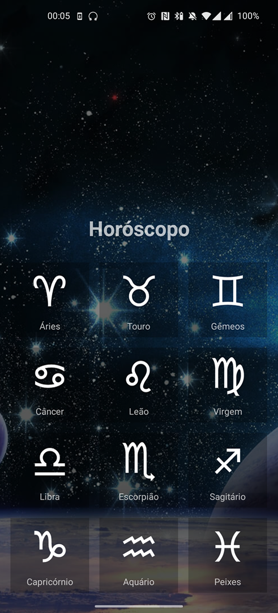
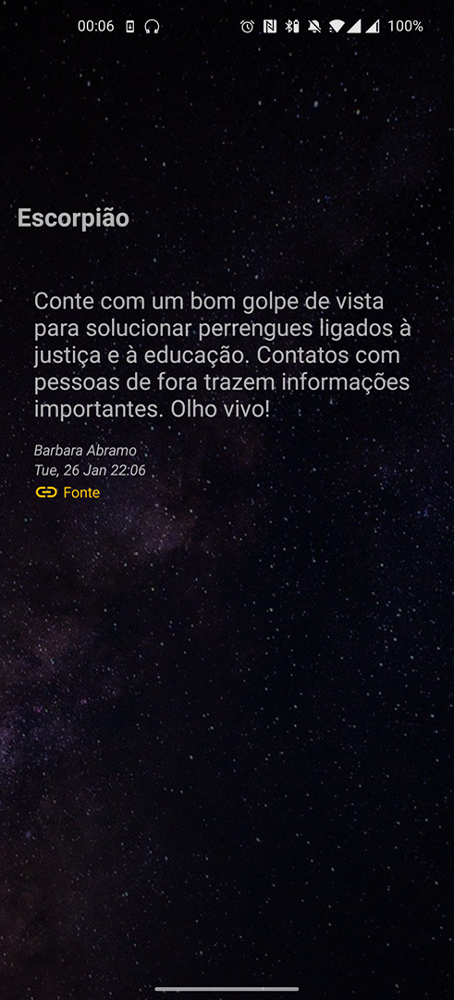

# Horoscope
### This is an example project using

  - MVP architecture for separating responsibilities from the code base.
  - Coroutines with suspend functions to ensure that they are not executed in the main thread.
  - API Rest com Retrofit.
  - api https://github.com/andrechavesg/babi-api-horoscopo

</img>
</img>
